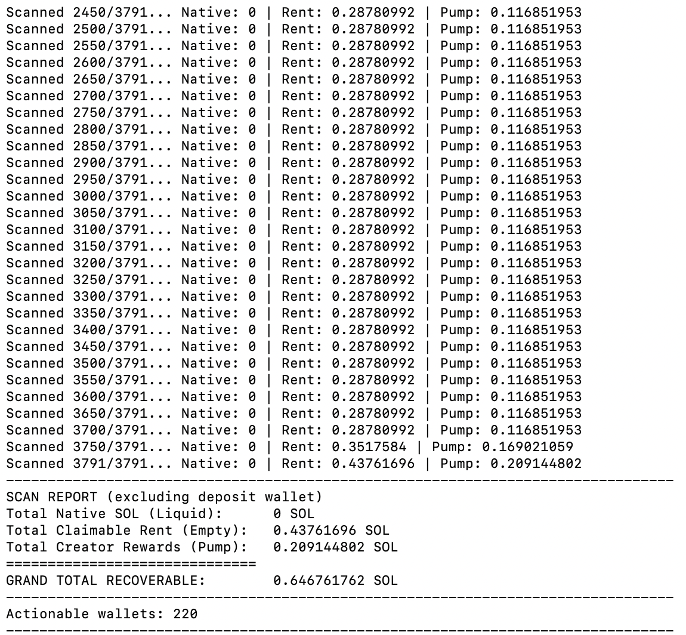

# Solana Reclaim Sweep

Reclaim rent from empty token accounts and Pump creator rewards across many wallets, then sweep the remaining SOL back to a deposit wallet. Dry run by default.

## Quick start

- Put keypairs under `./keys/`. The deposit wallet defaults to `./keys/deposit_wallet.json` (or set `DEPOSIT_WALLET_KEYPAIR_PATH`).
- `python3 -m venv .venv && source .venv/bin/activate`
- `pip install -r requirements.txt`
- Optional: `export HELIUS_API_KEY=...` or `export RPC_URL=...`
- Dry run: `python reclaim_and_sweep.py`
- Execute: `python reclaim_and_sweep.py --execute`

## Config

- Env: `KEYS_DIR`, `DEPOSIT_WALLET_KEYPAIR_PATH`, `RPC_URL`/`SOLANA_URL`, `HELIUS_API_KEY`
- Key formats: `.json` or `.json.gz` (solana-keygen 64-byte array or base58 string)
